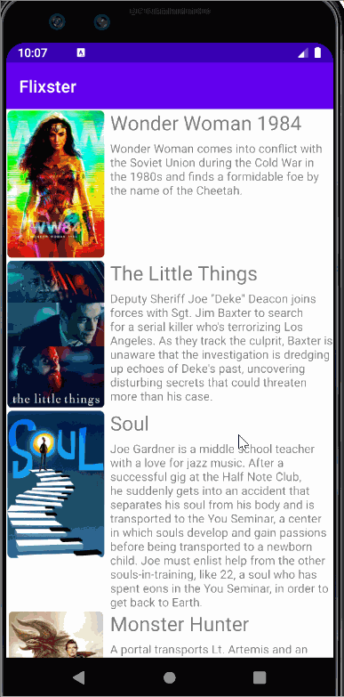
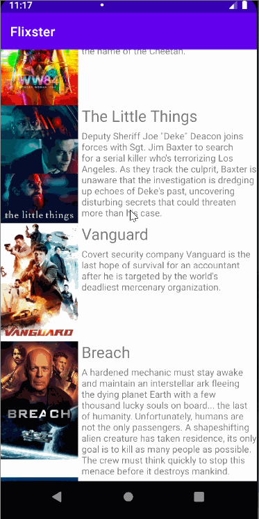
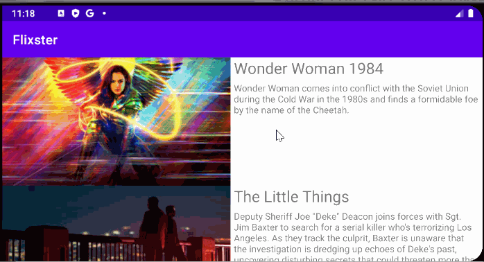

# Flixster
Flixster is an app that allows users to browse movies from the [The Movie Database API](http://docs.themoviedb.apiary.io/#). Made for the CodePath Android University course (Project 1).

## Features

The following features have been implemented:

- User can view a list of movies (title, poster image, and overview) currently playing in theaters from the Movie Database API.
- Views are responsive for both landscape/portrait mode.
   - In portrait mode, the poster image, title, and movie overview is shown.
   - In landscape mode, the rotated alternate layout uses a backdrop image instead and shows the title and movie overview to the right of it.
- Details of a movie (ratings using RatingBar, popularity, and synopsis) are shown in a separate activity.
- Video posts can be played in full-screen using the YouTubePlayerView.
- Used a shared element transition when user clicks into the details of a movie.
- Trailers for popular movies are played automatically when the movie is selected.
  - When clicking on a popular movie (i.e. a movie voted for more than 5 stars) the video is played immediately.
  - Less popular videos rely on the detailed page which shows an image preview that can initiate playing a YouTube video.
- Rounded corners applied to the images using the Glide transformations.

## Video Walkthough

Here's a walkthrough of some implemented features:

 

## Open-source libraries used
- [Android Async HTTP](https://github.com/codepath/CPAsyncHttpClient) - Simple asynchronous HTTP requests with JSON parsing
- [Glide](https://github.com/bumptech/glide) - Image loading and caching library for Android

### App Walkthough GIF

 
 

